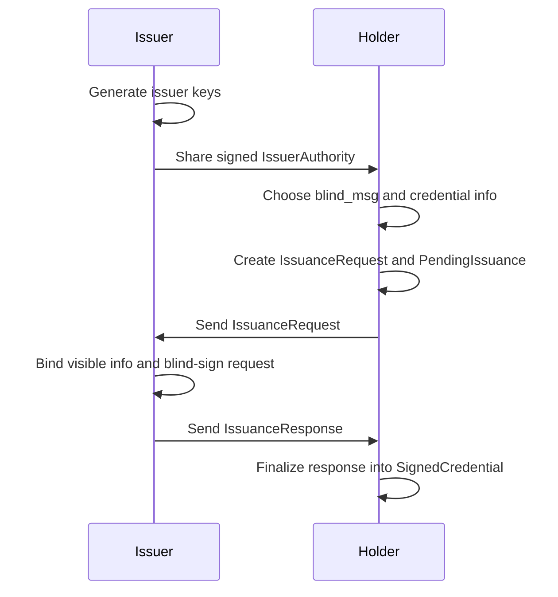
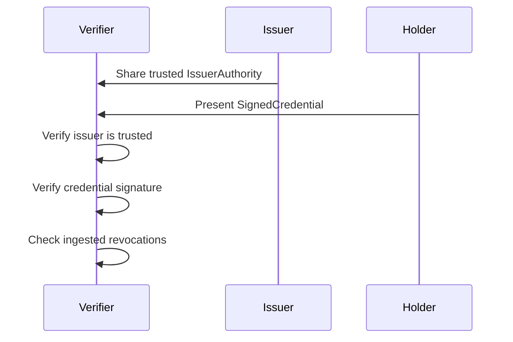
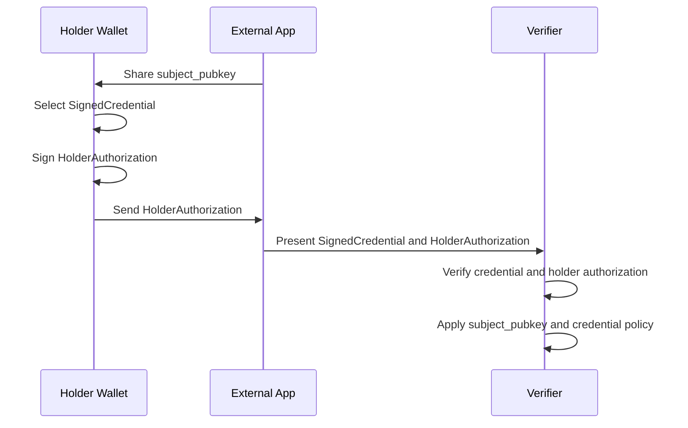
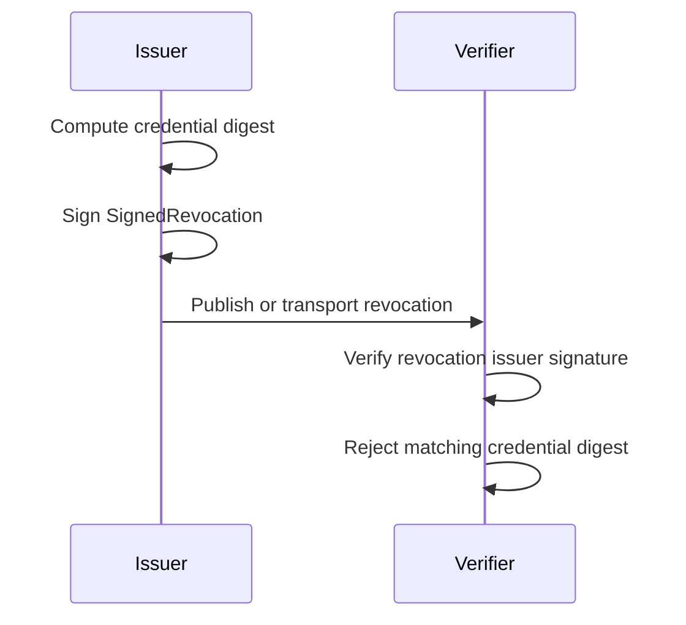

# Protocol Flow

The issuance protocol separates issuer-visible credential information from the
holder-hidden value that is blinded during signing.

## Issuance

## Verification

## Holder Authorization

The SDK signs holder authorizations with the holder identity key and derives
the credential digest from the selected `SignedCredential`. The verifier-side SDK
check verifies the credential, holder authorization signature, holder binding,
authorized credential digest, and authorization issued-at time. Subject-key
proof-of-possession, credential schema policy, storage, and transport stay in
the application.

## Revocation

`credential.info` is visible to the issuer during signing. `credential.blind_msg`
is hidden from the issuer during signing and disclosed in the final credential.
